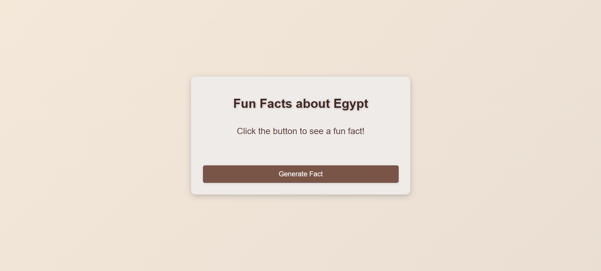
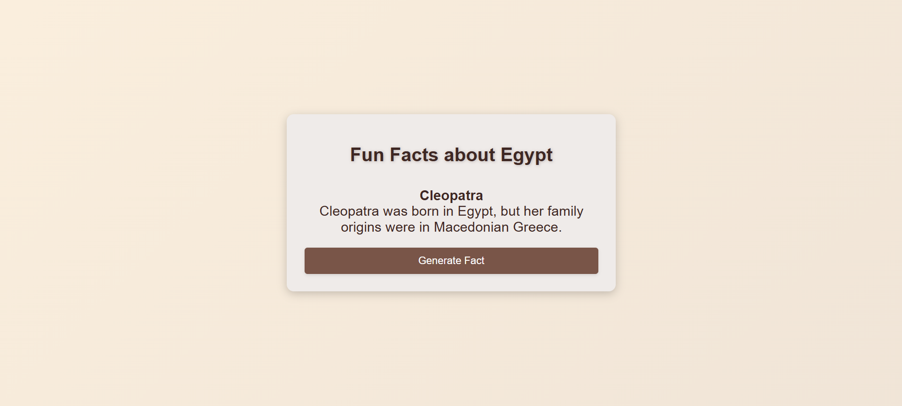

# GenAI 101 with Pieces - Personal Fun Facts Generator
## Facts about Egypt

*Welcome to the Personal Fun Facts Generator!*

This project was developed as part of the GenAI 101 workshop and serves as a capstone to demonstrate key concepts of Generative AI and Prompt Engineering. The app showcases how to utilize these techniques to create an engaging, interactive experience using HTML, CSS, and JavaScript. The project highlights the basics of building a web app, while integrating Pieces to create dynamic content.

### App : https://hansamalee0630.github.io/GenAI-fun_fact_app/




## Directory Structure
```
GenAI-fun_fact_app/
├── README.md
├── index.html
├── script.js
└── style.css
```

## Project Components
- `index.html`: Contains the basic structure of the web page, including the layout, content, and HTML elements.
- `script.js`: Includes JavaScript code that handles the functionality of the app.
- `style.css`: Defines the visual presentation and layout of the web page. It contains CSS rules that control the design aspects.

## Contributing
1. Fork the repository
2. Create your feature branch
3. Commit your changes
4. Push to the branch
5. Create a new Pull Request
